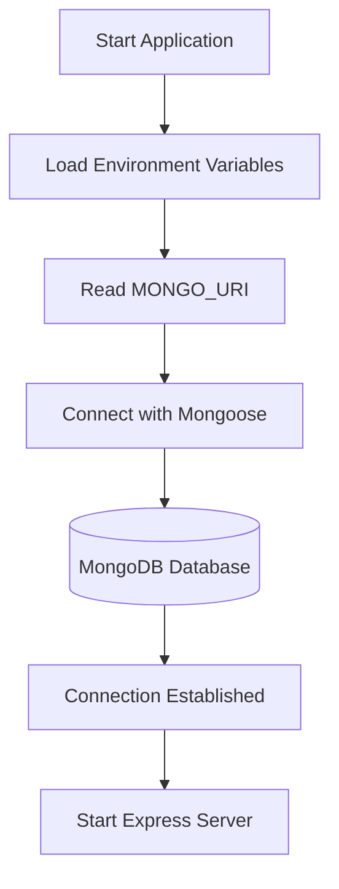

# MongoDB Configuration

## Project Overview

This document explains how to configure **MongoDB** for the **Nutrition Assistant – Personalized Nutrition Management System**. The backend uses **Mongoose** to establish a secure connection between the Node.js/Express.js application and the MongoDB database.

The database stores user information, meal records, food details, nutrition calculations, and daily nutrition logs, providing persistent storage for the application's core functionality.

---

# Technology Stack

* **MongoDB** – NoSQL database
* **Mongoose** – Object Data Modeling (ODM) library
* **Node.js** – JavaScript runtime
* **Express.js** – Backend framework
* **dotenv** – Environment variable management

---

# Prerequisites

Before configuring the database, ensure the following are installed:

* Node.js
* npm (Node Package Manager)
* MongoDB Atlas account or a local MongoDB server
* Visual Studio Code

---

# Installation

## 1. Install Mongoose

Navigate to the **Server** directory and install Mongoose.

```bash id="r8dk4m"
npm install mongoose
```

---

## 2. Install dotenv

Install **dotenv** to manage environment variables securely.

```bash id="6z3w1k"
npm install dotenv
```

---

## 3. Create the Environment File

Create a `.env` file inside the **Server** directory.

```text id="w8v2e7"
Server/
└── .env
```

Add the following environment variables:

```env id="0t9o2l"
MONGO_URI=mongodb+srv://<username>:<password>@cluster0.mongodb.net/NutritionAssistant
PORT=5000
JWT_SECRET=your_secret_key
```

> **Note:** Never commit your `.env` file or sensitive credentials to a public repository.

---

## 4. Configure the Database Connection

Create the database configuration file.

```text id="8l1m5n"
config/
└── db.js
```

### Responsibilities

* Connect to MongoDB using Mongoose.
* Load the MongoDB connection string from environment variables.
* Handle database connection errors.
* Export the database connection function.

---

## 5. Connect MongoDB in `server.js`

Import and initialize the database connection before starting the Express server.

```javascript id="l5g7c1"
const connectDB = require("./config/db");

connectDB();
```

---

# Project Structure

```text id="q4n7y2"
Server/
│
├── config/
│   └── db.js
│
├── .env
├── server.js
├── package.json
└── node_modules/
```

---

# Database Connection Workflow



---

# Database Collections

The application stores data in the following collections.

## Users

Stores user profile information.

* Name
* Email
* Password (hashed)
* Age
* Height
* Weight
* Gender
* Activity Level

---

## Meals

Stores meal records.

* Meal Name
* Meal Type
* Calories
* Protein
* Carbohydrates
* Fat

---

## Foods

Maintains the food database.

* Food Name
* Serving Size
* Calories
* Protein
* Carbohydrates
* Fat
* Fiber

---

## Nutrition

Stores nutrition-related calculations.

* BMI
* Daily Calorie Requirement
* Water Intake
* Nutrition Summary

---

## Daily Logs

Maintains users' daily nutrition history.

* Meals Consumed
* Calories Consumed
* Protein Intake
* Carbohydrates
* Fat
* Date

---

# Benefits of MongoDB

* Flexible document-oriented NoSQL database.
* Easy integration with Mongoose.
* High scalability for growing datasets.
* Fast read and write performance.
* Supports cloud deployment with MongoDB Atlas.
* Well suited for storing structured and semi-structured nutrition data.
* Simplifies data management for users, meals, and nutrition tracking.

---

# Outcome

MongoDB is successfully configured for the **Nutrition Assistant – Personalized Nutrition Management System** using **Mongoose**. The backend can securely connect to the database, manage user authentication, store meal and nutrition data, maintain daily logs, and support scalable RESTful API development.
