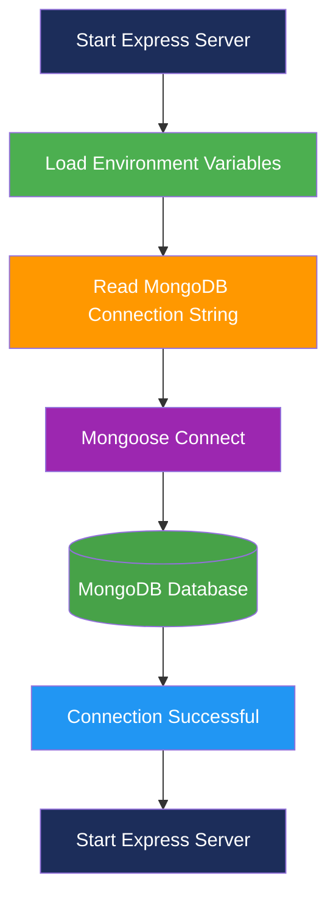

# CONFIGURE MONGODB

## Project Name

**Nutrition Assistant – Personalized Nutrition Management System**

## Technology Stack

MongoDB, Mongoose, Node.js, Express.js (MERN Stack)

---

# Objective

The MongoDB configuration is responsible for establishing a secure connection between the Nutrition Assistant backend application and the MongoDB database. Using **Mongoose**, the application communicates with the database to store and retrieve user information, meal records, nutrition data, and personalized diet recommendations.

---

# Prerequisites

Before configuring MongoDB, ensure the following are installed:

- Node.js
- npm (Node Package Manager)
- MongoDB Atlas Account (or Local MongoDB Server)
- Visual Studio Code

---

# Step 1: Install Mongoose

Open the **Server** folder in the Visual Studio Code terminal and install Mongoose.

```bash
npm install mongoose
```

---

# Step 2: Install dotenv

Install **dotenv** to securely manage environment variables.

```bash
npm install dotenv
```

---

# Step 3: Create Environment File

Inside the **Server** folder, create a file named:

```text
.env
```

Add your MongoDB connection string.

```env
MONGO_URI=mongodb+srv://<username>:<password>@cluster0.mongodb.net/NutritionAssistant
PORT=5000
JWT_SECRET=your_secret_key
```

---

# Step 4: Create Database Configuration

Inside the **config** folder create:

```text
config/
└── db.js
```

### Responsibilities

- Connect to MongoDB Atlas
- Initialize Mongoose
- Handle connection errors
- Export database connection

---

# Step 5: Connect Database in server.js

Import the database connection inside **server.js**.

```javascript
const connectDB = require("./config/db");

connectDB();
```

---

# MongoDB Folder Structure

```text
Server/
│
├── config/
│   └── db.js
│
├── .env
├── server.js
├── package.json
└── node_modules/
```

---

# Database Connection Workflow



---

# Database Responsibilities

The MongoDB database stores the following information:

## Users Collection

- Name
- Email
- Password
- Age
- Height
- Weight
- Gender
- Activity Level

---

## Meals Collection

- Meal Name
- Meal Type
- Calories
- Protein
- Carbohydrates
- Fat

---

## Food Collection

- Food Name
- Serving Size
- Calories
- Protein
- Carbohydrates
- Fat
- Fiber

---

## Nutrition Collection

- BMI
- Daily Calories
- Water Intake
- Nutrition Summary

---

## Daily Logs Collection

- Daily Meals
- Calories Consumed
- Protein Intake
- Carbohydrates
- Fat
- Date

---

# Advantages of Using MongoDB

- NoSQL document-oriented database
- Highly scalable
- Flexible schema design
- Fast read and write operations
- Easy integration with Mongoose
- Efficient storage of nutrition and meal records
- Supports cloud deployment using MongoDB Atlas

---

# Expected Outcome

Successfully configured MongoDB for the Nutrition Assistant backend using Mongoose. The application can securely connect to the database, store user information, manage meal records, perform nutrition tracking, and retrieve personalized diet recommendations.

---

**Project:** Nutrition Assistant – Personalized Nutrition Management System

**Technology Stack:** MERN Stack (MongoDB, Express.js, React.js, Node.js)
