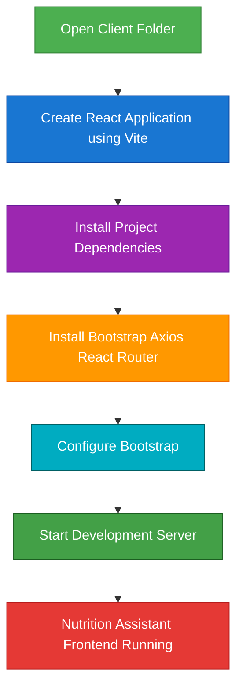

# CLIENT SETUP (INSTALLING REACT APPLICATION)

## Project Name

**Nutrition Assistant – Personalized Nutrition Management System**

## Technology Stack

React.js, Vite, JavaScript, Bootstrap, Axios (MERN Stack)

---

# Objective

The objective of this task is to configure and initialize the React.js frontend workspace for the **Nutrition Assistant – Personalized Nutrition Management System** using Vite. React provides a component-based architecture for developing interactive user interfaces, while Vite offers a fast development environment with Hot Module Replacement (HMR). This setup prepares the frontend for seamless communication with the Express.js backend through RESTful APIs.

---

# Software Requirements

- **Node.js:** Version 18.0.0 or higher
- **npm:** Version 9.0.0 or higher
- **Visual Studio Code:** Recommended IDE
- **Web Browser:** Google Chrome, Mozilla Firefox, Microsoft Edge, or Safari

---

# Setup Instructions

## Step 1: Open Client Folder

Open Visual Studio Code and navigate to the project directory.

```text
Nutrition-Assistant/
│
├── Client
└── Server
```

Open the integrated terminal and move into the Client folder.

```bash
cd Client
```

---

## Step 2: Create React Application Using Vite

Initialize the React project using Vite.

```bash
npm create vite@latest . -- --template react
```

### Selection Parameters

**Framework**

```text
React
```

**Variant**

```text
JavaScript
```

This command generates the complete React application inside the Client directory.

---

## Step 3: Install Project Dependencies

Install all required project dependencies.

```bash
npm install
```

This command downloads all packages defined in the **package.json** file and creates the **node_modules** directory.

---

## Step 4: Install Additional Libraries

Install the libraries required for the Nutrition Assistant frontend.

```bash
npm install axios react-router-dom bootstrap
```

### Package Description

| Package | Purpose |
|----------|---------|
| React Router DOM | Client-side routing |
| Axios | REST API communication |
| Bootstrap | Responsive UI components |

---

## Step 5: Import Bootstrap

Open **main.jsx** and import Bootstrap.

```javascript
import 'bootstrap/dist/css/bootstrap.min.css';
```

This enables Bootstrap styling throughout the application.

---

## Step 6: Start the Development Server

Run the React development server.

```bash
npm run dev
```

The terminal displays the local development URL.

```text
VITE v5.x.x ready

➜ Local:   http://localhost:5173/

➜ Network: use --host to expose
```

Open the URL in your browser to access the Nutrition Assistant frontend.

---

# Project Structure After Setup

After completing the setup, the Client directory will have the following structure.

```text
Client/
│
├── node_modules/            # Installed project dependencies
├── public/                  # Static assets
│
├── src/
│   ├── assets/              # Images, icons, CSS files
│   ├── components/          # Reusable React components
│   ├── pages/               # Application pages
│   ├── services/            # Axios API services
│   ├── App.jsx              # Root application component
│   ├── main.jsx             # React entry point
│   └── index.css            # Global stylesheet
│
├── package.json             # Project manifest
├── package-lock.json        # Dependency lock file
├── vite.config.js           # Vite configuration
└── index.html               # Main HTML template
```

---

# Client Setup Workflow

The following workflow illustrates the frontend initialization process.



---

# Commands Used

### Navigate to Client Folder

```bash
cd Client
```

### Create React Application

```bash
npm create vite@latest . -- --template react
```

### Install Dependencies

```bash
npm install
```

### Install Additional Libraries

```bash
npm install axios react-router-dom bootstrap
```

### Run Development Server

```bash
npm run dev
```

---

# Advantages of React with Vite

- Extremely fast development server startup.
- Hot Module Replacement (HMR) for instant updates.
- Component-based architecture for reusable UI development.
- Efficient state management using React.
- Easy integration with Express.js REST APIs.
- Responsive user interface using Bootstrap.
- Simplified API communication using Axios.
- Scalable frontend architecture for future enhancements.
- Optimized production builds using Vite.

---

# Expected Output

After successfully completing the setup:

1. The React.js application is initialized using Vite.
2. All frontend dependencies are installed successfully.
3. Bootstrap, Axios, and React Router are configured.
4. The standard React project structure is created.
5. The Vite development server runs without errors.
6. The Nutrition Assistant frontend is accessible at **http://localhost:5173/**.
7. The frontend is ready for integration with the Express.js backend APIs.

---

# Conclusion

The client setup establishes a modern and efficient frontend development environment for the **Nutrition Assistant – Personalized Nutrition Management System**. By combining React.js, Vite, Bootstrap, Axios, and React Router, the application provides a fast, responsive, and scalable user interface capable of seamless communication with the backend services through RESTful APIs. This foundation enables efficient development, easy maintenance, and future expansion of the Nutrition Assistant application.
