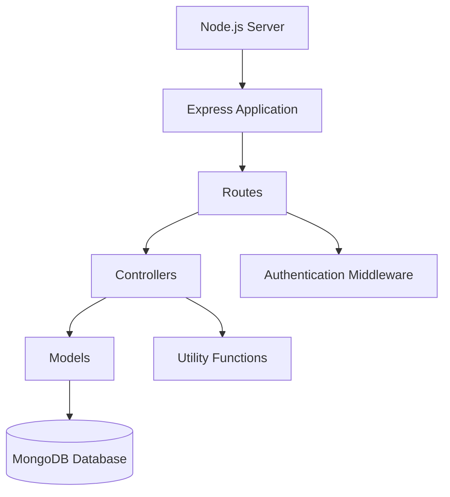

# SERVER SETUP (npm init)

## Project Name

**Nutrition Assistant – Personalized Nutrition Management System**

## Technology Stack

- Node.js
- Express.js
- MongoDB
- Mongoose
- JWT Authentication
- MERN Stack

---

# Objective

The objective of this task is to initialize the backend environment for the Nutrition Assistant – Personalized Nutrition Management System using Node.js and Express.js. This setup establishes the foundation for building RESTful APIs, implementing authentication, managing nutrition-related data, handling business logic, and connecting the application to MongoDB.

---

# Software Requirements

- Node.js (Version 18.0.0 or higher)
- npm (Version 9.0.0 or higher)
- MongoDB (Local Installation or MongoDB Atlas)
- Visual Studio Code

---

# Setup Instructions

## Step 1: Open the Server Folder

Open the Visual Studio Code terminal and navigate to the backend folder.

```bash
cd server
```

---

## Step 2: Initialize Node.js Project

Create the Node.js project.

```bash
npm init -y
```

This command creates the default **package.json** file.

Example:

```json
{
  "name": "nutrition-assistant-server",
  "version": "1.0.0",
  "description": "Backend for Nutrition Assistant",
  "main": "server.js",
  "scripts": {
    "start": "node server.js"
  },
  "license": "ISC"
}
```

---

## Step 3: Install Required Packages

Install the required dependencies.

```bash
npm install express mongoose cors dotenv bcryptjs jsonwebtoken
```

Install Nodemon for development.

```bash
npm install --save-dev nodemon
```

---

## Step 4: Update package.json

Update the scripts section.

```json
"scripts": {
  "start": "node server.js",
  "dev": "nodemon server.js"
}
```

Run the development server.

```bash
npm run dev
```

---

## Step 5: Create the Main Server File

Create the backend entry file.

```
server.js
```

Example:

```javascript
const express = require("express");
const cors = require("cors");
const dotenv = require("dotenv");

dotenv.config();

const app = express();

app.use(cors());
app.use(express.json());

app.get("/", (req, res) => {
    res.send("Nutrition Assistant Backend Running...");
});

const PORT = process.env.PORT || 5000;

app.listen(PORT, () => {
    console.log(`Server Running on Port ${PORT}`);
});
```

---

## Step 6: Create Backend Folders

Create the following folders inside the **server** directory.

### config/

Contains database configuration.

Example:

- db.js

---

### models/

Contains MongoDB schemas.

Examples:

- User.js
- Meal.js
- DailyLog.js

---

### controllers/

Contains business logic.

Examples:

- authController.js
- profileController.js
- mealController.js
- foodController.js
- dailyLogController.js

---

### routes/

Contains API endpoints.

Examples:

- authRoutes.js
- profileRoutes.js
- mealRoutes.js
- foodRoutes.js
- dailyLogRoutes.js

---

### middleware/

Contains middleware functions.

Example:

- authMiddleware.js

---

### utils/

Contains reusable utility functions.

Examples:

- bmiCalculator.js
- calorieCalculator.js

---

# Backend Folder Structure

```text
server/
│
├── package.json
├── package-lock.json
├── server.js
├── .env
│
├── config/
│   └── db.js
│
├── controllers/
│   ├── authController.js
│   ├── profileController.js
│   ├── mealController.js
│   ├── foodController.js
│   └── dailyLogController.js
│
├── middleware/
│   └── authMiddleware.js
│
├── models/
│   ├── User.js
│   ├── Meal.js
│   └── DailyLog.js
│
├── routes/
│   ├── authRoutes.js
│   ├── profileRoutes.js
│   ├── mealRoutes.js
│   ├── foodRoutes.js
│   └── dailyLogRoutes.js
│
└── utils/
    ├── bmiCalculator.js
    └── calorieCalculator.js
```

---

# Backend Architecture



---

# Advantages

- Modular MVC Architecture
- Secure JWT Authentication
- Organized Folder Structure
- Easy API Maintenance
- MongoDB Integration
- Reusable Utility Functions
- Scalable Backend Design
- RESTful API Development
- Easy Frontend Integration
- Future Expansion Support

---

# Expected Output

After completing the server setup:

- Node.js backend project is initialized.
- Required packages are installed.
- Express server is configured.
- Backend folder structure is created.
- MVC architecture is established.
- MongoDB configuration is ready.
- REST API development can begin.
- Backend is prepared for integration with the React frontend.

---

## Conclusion

The backend setup provides a scalable and maintainable foundation for the Nutrition Assistant – Personalized Nutrition Management System. Using Node.js, Express.js, and MongoDB with the MVC architecture ensures efficient API development, secure authentication, organized business logic, and seamless communication with the React frontend.
